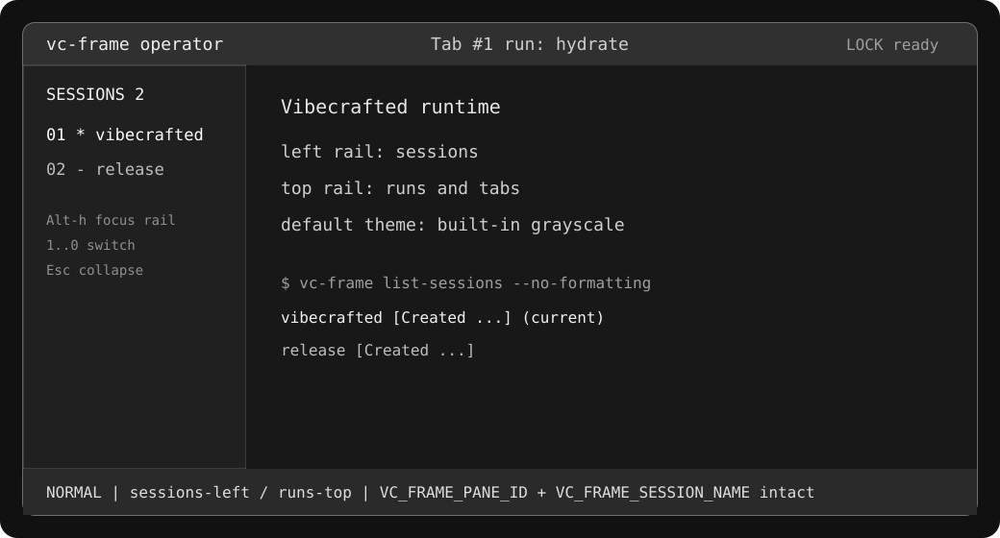

<h1 align="center">
  <br>
  vc-frame ⚒ (vibecrafted runtime)
  <br>
  <br>
</h1>

<p align="center">
  
</p>
<h4 align="center">
  [<a href="docs/VC_FRAME_OPERATOR_SURFACE.md">Operator Surface</a>]
  [<a href="#how-do-i-install-it">Install</a>]
  [<a href="docs/RELEASE.md">Release Runbook</a>]
  [<a href="docs/TERMINOLOGY.md">Terminology</a>]
  [<a href="https://zellij.dev/documentation/">Upstream Zellij Docs</a>]
</h4>

# What is this?

vc-frame is a vibecrafted runtime and terminal workspace built on the Zellij core. It is aimed at developers, operators, AI-agent workflows, and anyone who lives in the terminal. Similar programs are sometimes called "Terminal Multiplexers".

vc-frame keeps the Zellij philosophy that one must not sacrifice simplicity for power, while adding a fork-owned surface for Vibecrafted operator workflows.

The default vc-frame surface is now grayscale-first and dual-rail: sessions live in a persistent left rail, while runs and tabs stay in the familiar top bar. Color themes remain available as explicit opt-in themes.

vc-frame is geared toward beginner and power users alike - allowing deep customizability, personal automation through [layouts](https://zellij.dev/documentation/layouts.html), true multiplayer collaboration, unique UX features such as floating and stacked panes, and a [plugin system](https://zellij.dev/documentation/plugins.html) allowing one to create plugins in any language that compiles to WebAssembly.

vc-frame includes a built-in [web-client](https://zellij.dev/tutorials/web-client/), making a terminal optional.

You can get started from a tagged release or build `vc-frame` locally.

For the redesign promise, proof, and quick-start path, read [docs/VC_FRAME_OPERATOR_SURFACE.md](docs/VC_FRAME_OPERATOR_SURFACE.md).

## Default operator surface

Fresh starts with no theme configured use built-in grayscale styling for ordinary chrome: frames, tab bars, status ribbons, lists, tables, and default text accents. Named color themes are still shipped, but they are opt-in.

The default layout has two rails:

- **Sessions left:** a 24-column `session-manager` rail (`rail true`) with ordinal switching.
- **Runs top:** the existing `tab-bar` remains the run/tab surface.

The Vibecrafted fleet contracts are still release-blocking: `list-sessions --no-formatting` keeps `[Created ...]` / `(current)` liveness output, and panes still receive `VC_FRAME_PANE_ID` / `VC_FRAME_SESSION_NAME`.

## How do I install it?

For a published release, use the signed GitHub Release installer:

```bash
VCFRAME_GPG_FINGERPRINT=<pinned-fingerprint> \
  sh -c "$(curl -fsSL https://github.com/vetcoders/vc-frame/releases/latest/download/install.sh)"
vc-frame --version
```

Before the first release is published, use a source checkout:

```bash
make install
```

This installs `vc-frame`. Existing Zellij configuration and layout concepts
remain compatible, but vc-frame does not claim ownership of the public
`zellij` executable or package channel.

This is not the same as a public package channel. Upstream distro/Homebrew packages named `zellij` install upstream Zellij, not this Vetcoders `vc-frame` runtime. See [docs/THIRD_PARTY_INSTALL.md](docs/THIRD_PARTY_INSTALL.md) for that compatibility boundary and [docs/RELEASE.md](docs/RELEASE.md) for the release-grade `curl ... | sh` path.

#### Installing from `main`
Installing vc-frame from an arbitrary development branch is not recommended for daily use. Development branches represent pre-release code, are constantly being worked on, and may contain broken or unusable features.

That being said - no-one will stop you from using it (and bug reports involving new features are greatly appreciated), but outside users should prefer a tagged vc-frame release once one is published.

## How do I start a development environment?

* Clone the project
* In the project folder, for debug builds run: `cargo xtask run`
* To run all tests: `cargo xtask test`

For more build commands, see [CONTRIBUTING.md](CONTRIBUTING.md).

## Configuration
vc-frame keeps compatibility with Zellij configuration and layout concepts. For inherited syntax, see the [upstream Zellij configuration documentation](https://zellij.dev/documentation/configuration.html). For vc-frame-specific default surface and theme behavior, see [docs/VC_FRAME_OPERATOR_SURFACE.md](docs/VC_FRAME_OPERATOR_SURFACE.md).

## Vibecrafted Shell Layouts
This fork also ships built-in Vibecrafted operator layouts meant to back the
`vibecrafted` flow when repo-owned config is not available:

- `vibecrafted` — operator-first shell surface
- `vc-dashboard` — mission control monitoring grid
- `vc-workflow` — implementation workspace
- `vc-marbles` — convergence workspace
- `vc-research` — synthesis + research swarm workspace

Use them the same way as the stock built-ins, for example:

```bash
vc-frame -l vibecrafted
vc-frame -l vc-dashboard
vc-frame setup --dump-layout vibecrafted
vc-frame setup --dump-layout vc-dashboard
```

They are exposed as first-class built-ins, so they also surface in layout
discovery flows such as the session/layout management UIs instead of behaving
like ad-hoc repo-only files.

The shell-provider layouts resolve mission-control helpers from the standard
home store first, then from a companion repo checkout at
`~/Libraxis/vibecrafted` via `VIBECRAFTED_COMPANION_ROOT`, and finally from
repo-local stores. `vc-dashboard` also acts as a branded control hub for the
native vc-frame surfaces we lean on most: live monitoring, session atlas, layout
forge, configuration control, plugin curation, workspace navigation, sharing,
and the Vibecrafted shell guide.

### Installing repo-owned layouts into `~/.config/zellij/layouts/`

The Vibecrafted framework ships its canonical layouts (`dashboard`, `marbles`,
`operator`, `research`, `workflow`) as real `.kdl` files under
`<vibecrafted-root>/config/zellij/layouts/`. To make them visible to stock
`vc-frame --layout <name>` invocations, run:

```bash
vc-frame setup --install-vibecrafted-layouts
# or with explicit root:
vc-frame setup --install-vibecrafted-layouts --vibecrafted-root /path/to/vibecrafted
```

The installer:

1. **Resolves the framework root dynamically.** Order: `--vibecrafted-root`
   flag → `$VIBECRAFTED_HOME` env (with a `tools/vibecrafted-current` fallback
   for the standard `$HOME/.vibecrafted` user-home convention) → `which
   vibecrafted` canonicalized and walked up until a directory containing
   `config/zellij/layouts/` is found. If none of these succeed, or if the
   resolved path lacks a populated layouts directory, the installer exits
   non-zero with a clear error — silent installs against a wrong path are
   refused.
2. **Enumerates layouts from the live filesystem listing** of
   `<root>/config/zellij/layouts/*.kdl`. There is no hardcoded list in the
   Rust source. Add a `foo.kdl` to the repo, re-run the installer, and
   `~/.config/zellij/layouts/foo.kdl` appears without any code change.
3. **Cleans up stale symlinks.** On every run, symlinks under
   `~/.config/zellij/layouts/` whose target either no longer exists or points
   into the vibecrafted tree are removed. Non-symlink files (your hand-written
   layouts) and symlinks pointing at unrelated frameworks are left alone.
4. **Applies a data-driven alias map.** If
   `<root>/config/zellij/layouts/aliases.txt` exists, each line in the form
   `old=new` installs a compatibility symlink at
   `~/.config/zellij/layouts/<old>` pointing at the current
   `<root>/config/zellij/layouts/<new>` layout file. Lines starting with `#`
   and blank lines are ignored. Aliases whose `<new>` target no longer exists
   are dropped (and any pre-existing broken symlink for `<old>` is removed)
   rather than silently kept as broken links. Edit `aliases.txt`, re-run the
   installer — no rebuild needed.
5. **Prints a summary** listing every symlink created, re-pointed, already
   correct, stale-removed, alias installed, alias dropped, and non-symlink
   file preserved. Re-runs are idempotent — running the installer twice in a
   row produces identical filesystem state and identical summary output.

Example `aliases.txt` mapping the legacy names the Vibecrafted framework
shipped before the canonical rename:

```
# Legacy compatibility map — keeps old layout names working after rename.
vc-dashboard.kdl=dashboard.kdl
vc-marbles.kdl=marbles.kdl
vc-research.kdl=research.kdl
vc-workflow.kdl=workflow.kdl
implement-dual.kdl=workflow.kdl
research-grid.kdl=research.kdl
vibecraft.kdl=operator.kdl
vibecrafted.kdl=operator.kdl
```

## About issues in this repository
Issues in this repository, whether open or closed, do not necessarily indicate a problem or a bug in the software. They only indicate that the reporter wanted to communicate their experiences or thoughts to the maintainers. The vc-frame maintainers do their best to go over and reply to all issue reports, but unfortunately cannot promise these will always be dealt with or even read. Your understanding is appreciated.

## Upstream roadmap
Presented here is the inherited upstream Zellij roadmap, divided into three main sections.

These are issues that are either being actively worked on or are planned for the near future.

***If you'll click on the image, you'll be led to an SVG version of it on the website where you can directly click on every issue***

[](https://zellij.dev/roadmap)

## Origin of the upstream name
[From Wikipedia, the free encyclopedia](https://en.wikipedia.org/wiki/Zellij)

Zellij (Arabic: الزليج, romanized: zillīj; also spelled zillij or zellige) is a style of mosaic tilework made from individually hand-chiseled tile pieces. The pieces were typically of different colours and fitted together to form various patterns on the basis of tessellations, most notably elaborate Islamic geometric motifs such as radiating star patterns composed of various polygons. This form of Islamic art is one of the main characteristics of architecture in the western Islamic world. It is found in the architecture of Morocco, the architecture of Algeria, early Islamic sites in Tunisia, and in the historic monuments of al-Andalus (in the Iberian Peninsula).

## License

MIT
